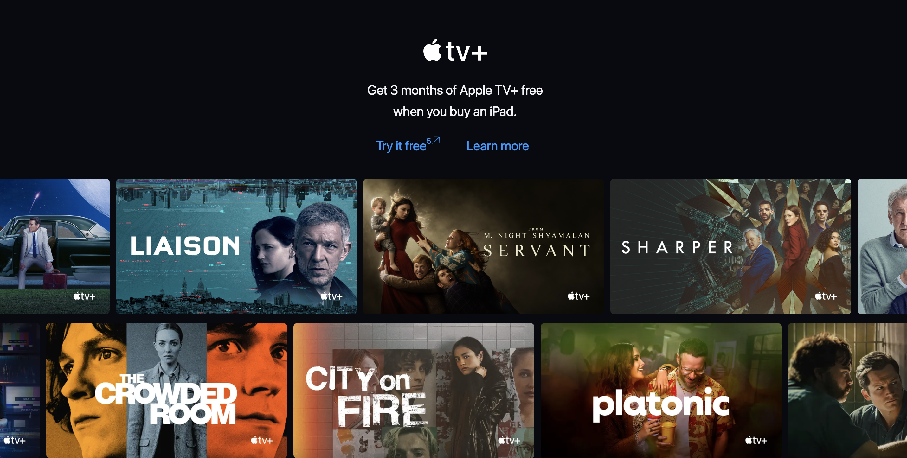

# react-apple-tv

React Apple TV is a slide show movie list adapted from AppleTv+. It is created using React and SCSS.

## Demo



## Project Structure

```
├── __test__
├── node_modules
├── public
│   ├── index.html
├── src
│   ├── icons
│   │   ├── apple-tv-plus.tsx
│   │   ├── arrow-links.tsx
│   ├── App.tsx
│   ├── source.ts
│   ├── style.css
├── types
│   ├── index.d.ts
├── index.tsx
├── package.json
├── package-lock.json
├── tsconfig.json
├── webpack.config.js
```

#### Animates

Animates are divided by two sections and then every section is looped. In the loop function then set transform linear into duration 12s and set translate using setState.

```bash
...
const animates = () => {
    const list = []
    for(let i=0; i<2; i++) {
      list.push({
        transform: `translateX(${i > 0 ? (translate - 110) : translate}px)`,
        transitionDuration: '12s',
        transitionTimingFunction: 'linear',
      })
    }
    return list
}

React.useEffect(() => {
    setTranslate(-600)
})
...
```

## License

MIT © [faridho](https://github.com/faridho)
